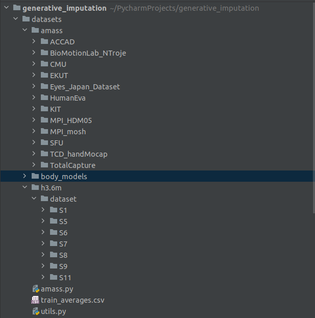

# Generative Imputation


## Dependencies
Some older versions may work. But we used the following:

* cuda 10.1 (batch size depends on GPU memory)
* Python 3.6.9
* [Pytorch](https://github.com/pytorch/pytorch) 1.6.0
* [progress 1.5](https://pypi.org/project/progress/)
* Tensorboard

## Get the data
[Human3.6m](http://vision.imar.ro/human3.6m/description.php) in exponential map can be downloaded from [here](http://www.cs.stanford.edu/people/ashesh/h3.6m.zip).

[AMASS](https://amass.is.tue.mpg.de/index.html) was obtained from the [repo](https://amass.is.tue.mpg.de/download.php), you need to make an account.

Once downloaded the datasets should be added to the datasets folder, example below.



## Training commands
To train HG-VAE as in the paper:
```bash
python3 main.py --name "saved_models/HGVAE" --lr 0.0001 --warmup_time 200 --beta 0.0001 --n_epochs 500 --variational --output_variance --train_batch_size 800 --test_batch_size 800
```
see opt.py for all training options. By default checkpoints are saved every 10 epochs. Training may be stop, and resumed by using --start_epoch flag, for example
```bash
python3 main.py --start_epoch 31 --name "saved_models/HGVAE" --lr 0.0001 --warmup_time 200 --beta 0.0001 --n_epochs 500 --variational --output_variance --train_batch_size 800 --test_batch_size 800
```
will start retraining from the checkpoint saved after epoch 30. We also use the start_epoch flag to select the checkpoint to use when using the trained model.

## Occlusion experiments
```bash
python3 occlusion_experiment.py
```
to run occlusion experiments. This file assumes the above directory structure defined above "saved_models/HGVAE".

## Licence

MIT
